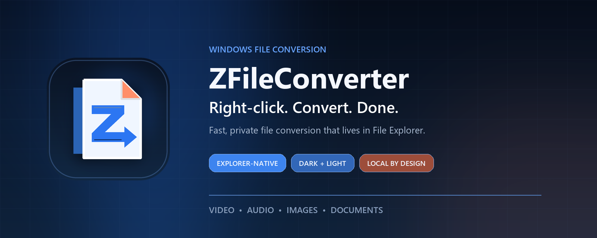
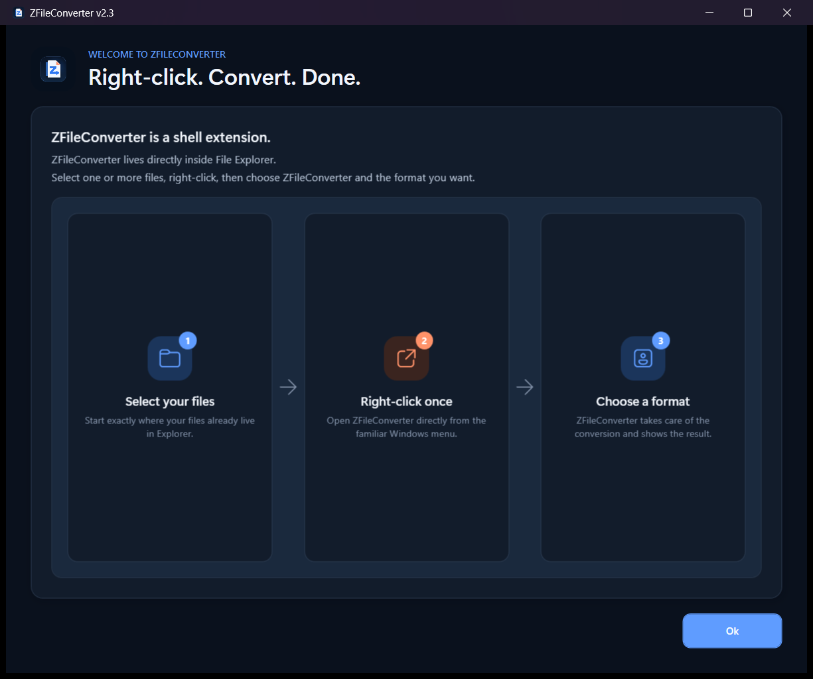
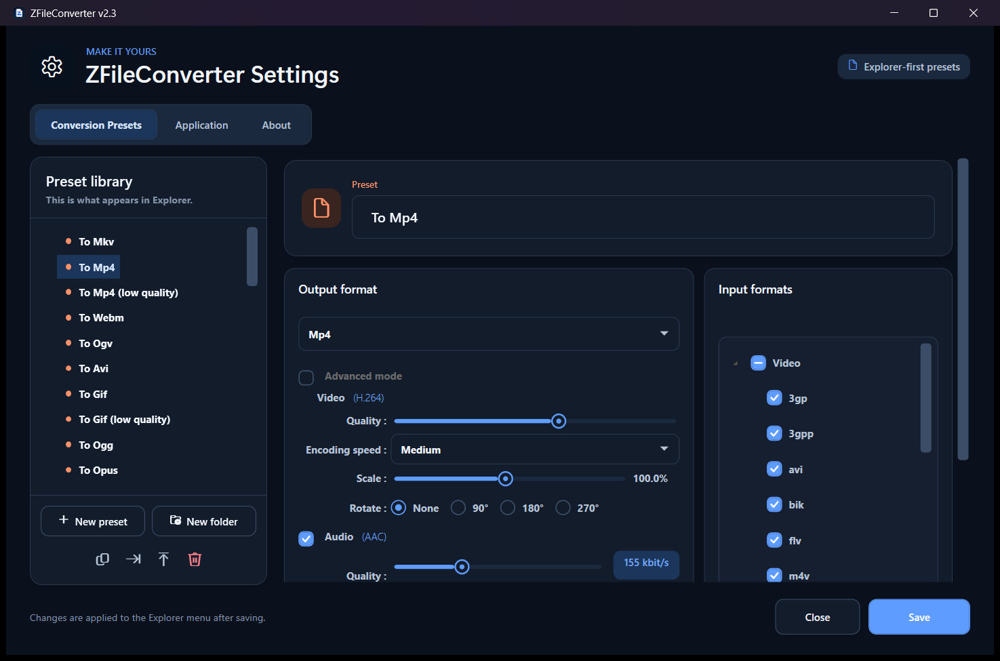
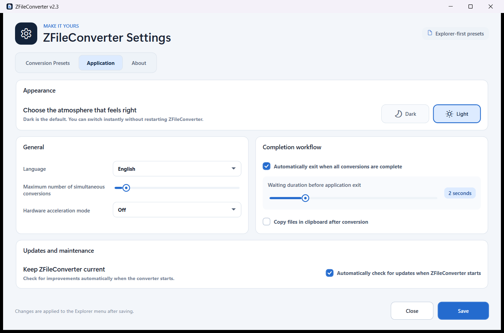

<p align="center">
  
</p>

<p align="center">
  Explorer-native file conversion for Windows. No account, no uploads, no separate workflow.
</p>

<p align="center">
  <a href="https://github.com/ZaidNAlAsali/ZFileConverter/releases/download/v2.3.1/ZFileConverter-setup.msi"><strong>Download ZFileConverter 2.3.1</strong></a>
  ·
  <a href="CHANGELOG.md">Release notes</a>
  ·
  <a href="https://github.com/ZaidNAlAsali/ZFileConverter/issues">Report an issue</a>
</p>

## Conversion should start where your files already are

ZFileConverter lives inside File Explorer. Select one or more files, right-click, choose a format, and the conversion begins. There is no import screen to manage and no cloud service waiting for your files.

<p align="center">
  
</p>

### Why it feels different

| | |
|---|---|
| **Explorer-native** | Relevant conversion presets appear directly in the Windows context menu. |
| **Local by design** | File contents are processed on your machine rather than uploaded to a conversion service. |
| **Curated defaults** | A focused 16-preset first-run library covers common jobs without flooding the context menu. |
| **Deeply configurable** | Create, duplicate, organize, import, export, and tune presets when you need more control. |
| **Made for batches** | Convert multiple selected files with progress, estimated time, cancellation, and configurable concurrency. |
| **Native Windows experience** | Purpose-built dark and light themes, native title bars, keyboard support, and Windows taskbar progress. |

## Everyday conversions

The first-run library is intentionally compact. File Explorer filters it again based on what you selected.

| Category | Ready-to-use outputs |
|---|---|
| **Video** | MP4, MKV, WebM, GIF |
| **Audio** | MP3, WAV, FLAC |
| **Images** | JPG, PNG, WebP, AVIF, GIF |
| **Documents** | PDF, DOCX, paged PNG |
| **Disc extraction** | DVD to MP4, audio CD to MP3 |

Advanced video, audio, image, naming, scaling, rotation, quality, and post-conversion behavior remain available in the preset editor.

## Dark by default. Light when you want it.

The 2.3 interface was rebuilt as a cohesive native WPF product rather than recolored screen by screen. Theme changes apply instantly and persist across launches.

<p align="center">
  
  
</p>

## Documents without a cloud round trip

ZFileConverter detects Microsoft Office through both App Paths and COM registration. When a compatible Microsoft Office application is unavailable or its export fails, supported document-to-PDF workflows can fall back to a local LibreOffice installation.

- Word, Excel, and PowerPoint documents can be converted to PDF.
- Document pages can be rendered to image formats through the PDF pipeline.
- PDF files can be converted to DOCX through Microsoft Word or LibreOffice when available.
- Generated outputs are checked before a conversion is marked successful.
- LibreOffice runs headlessly in an isolated temporary profile with bounded execution and captured diagnostics.

> Document fidelity depends on the source file and the available Office engine. ZFileConverter reports failures rather than treating a missing or empty output as success.

### Optional LibreOffice fallback

Install LibreOffice normally, add `soffice.exe` to `PATH`, or set:

```text
LIBREOFFICE_PATH=C:\Program Files\LibreOffice\program\soffice.exe
```

ZFileConverter also checks the standard 64-bit and 32-bit LibreOffice installation paths.

## Install

1. Download [`ZFileConverter-setup.msi`](https://github.com/ZaidNAlAsali/ZFileConverter/releases/download/v2.3.1/ZFileConverter-setup.msi).
2. Run the installer.
3. Select files in File Explorer and open the **ZFileConverter** context menu.

### Requirements

- 64-bit Windows
- .NET Framework 4.8 or later
- Microsoft Office or LibreOffice only for the document conversions that need them

The installer checks for .NET Framework 4.8 and registers the Explorer extension. Community builds may prompt Windows SmartScreen until a trusted signing certificate is available.

## Presets that stay yours

The Settings window is the source of truth for the Explorer menu. You can:

- create and duplicate presets;
- organize presets into folders;
- choose the accepted input extensions;
- tune codecs, quality, scaling, rotation, and audio behavior;
- configure output naming and destination rules;
- export presets for sharing or import them later.

Upgrading to 2.3 preserves existing and customized preset libraries. The smaller 16-preset collection is used for fresh first-run settings rather than deleting a long-time user's configuration.

## Command line and automation

ZFileConverter keeps the Explorer workflow first, but its headless path is useful for scripts and deterministic automation.

```bash
FileConverter.exe --headless --conversion-preset "To Jpg" "C:\path\image.png"
FileConverter.exe --headless --conversion-preset "To Pdf" "C:\path\document.docx"
FileConverter.exe --exit-when-finished --fail-on-error --conversion-preset "To Mp3" "C:\path\video.mp4"
```

`--headless` implies `--exit-when-finished` and `--fail-on-error`.

## Build from source

### Toolchain

- Visual Studio 2022 or Visual Studio Build Tools 2022
- .NET Framework 4.8 targeting pack
- WiX Toolset 5, restored through NuGet
- Python with Pillow only if regenerating the brand assets

From Git Bash or MSYS:

```bash
"/c/Program Files (x86)/Microsoft Visual Studio/2022/BuildTools/MSBuild/Current/Bin/MSBuild.exe" \
  FileConverter.sln \
  -t:Restore,Build \
  -p:Configuration=Release \
  -p:Platform=x64 \
  -v:minimal
```

Release outputs:

```text
Application/FileConverter/bin/x64/Release/FileConverter.exe
Installer/bin/x64/Release/ZFileConverter-setup.msi
```

Regenerate the icon and repository hero with:

```bash
python Tools/generate-brand-assets.py
```

## Privacy and updates

Conversions run locally. ZFileConverter does not upload selected files to a remote conversion API. When automatic update checking is enabled, the application retrieves version metadata from this GitHub repository and downloads an installer only when the user accepts an available upgrade.

## Contributing

Bug reports and focused improvements are welcome. Start with [`CONTRIBUTING.md`](CONTRIBUTING.md), include diagnostics where relevant, and remove private filenames or paths before attaching logs.

Security-sensitive reports should follow [`SECURITY.md`](SECURITY.md).

## Credits and license

ZFileConverter is a modernized fork of the original **File Converter** project by Adrien Allard and its contributors. Their work established the Explorer-first conversion model and much of the format support this project continues to build on.

ZFileConverter remains free software under the [GNU General Public License v3](LICENSE.md).
